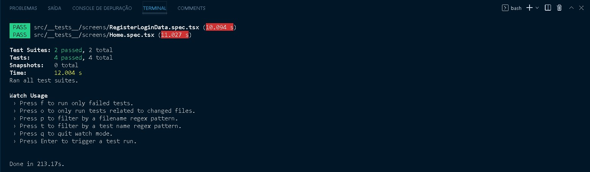
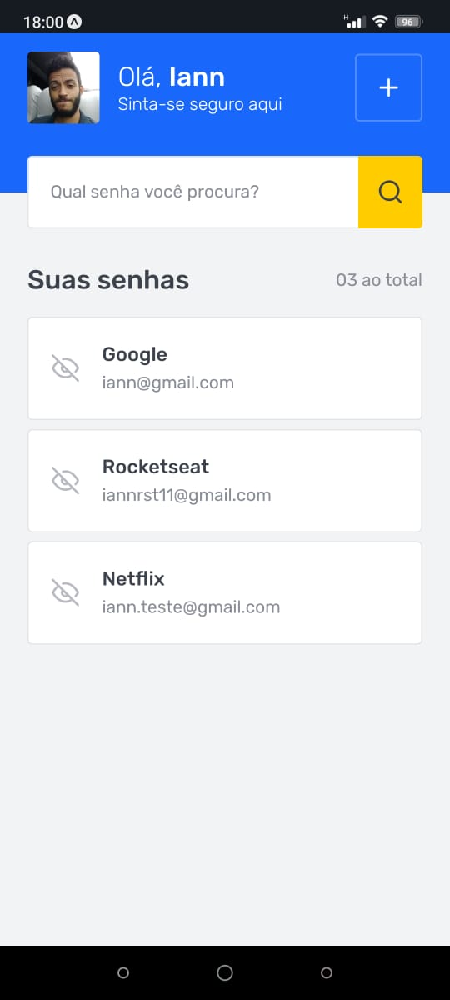
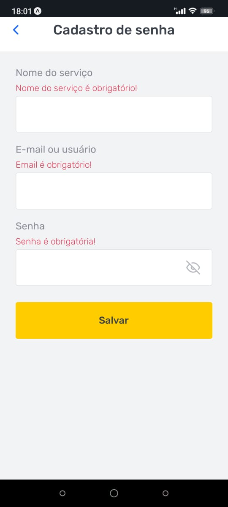
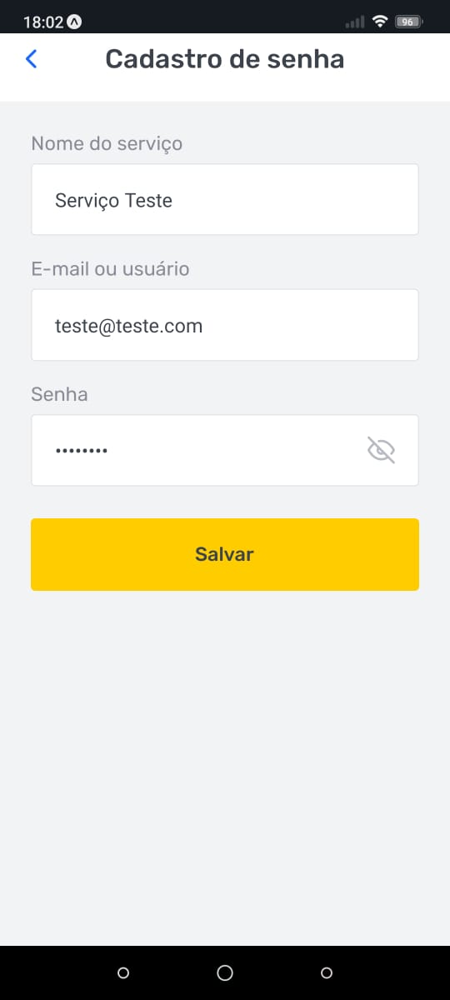
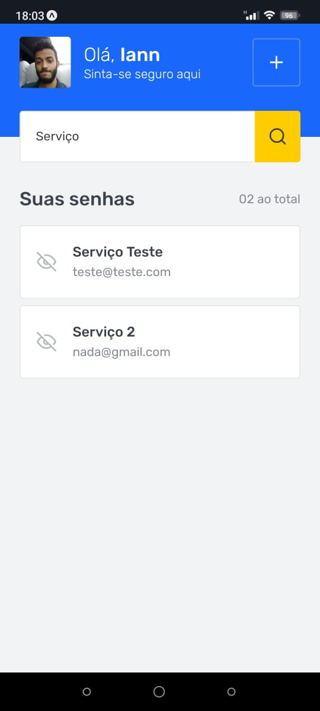

# Desafio: SavePass

Nesse desafio você irá treinar o que aprendeu até agora com React Hook Form e navegação construindo um aplicativo para gerenciamento de senhas.

Essa aplicação possui duas telas, sendo a primeira delas uma listagem das senhas salvas e a segunda a tela de cadastro de novos logins.

## :dart: Desafio: Implementações das funcionalidades
- [x] Carregar as informações salvas no AsyncStorage.

- [x] Implementar a barra de busca.

- [x] Adicionar novas senhas.

## :camera: Testes e Screenshots

### Testes

  

### Screenshots da aplicação

  
  
  
  

## :man_technologist: Tecnologias
 - [x] React;
 - [x] React Native;
 - [x] React Navigation;
 - [x] React Hook Form;
 - [x] Yup;
 - [x] Expo Go;
 - [x] Hooks (useState, useFocusEffect, useCallback);
 - [x] AsyncStorage;
 

